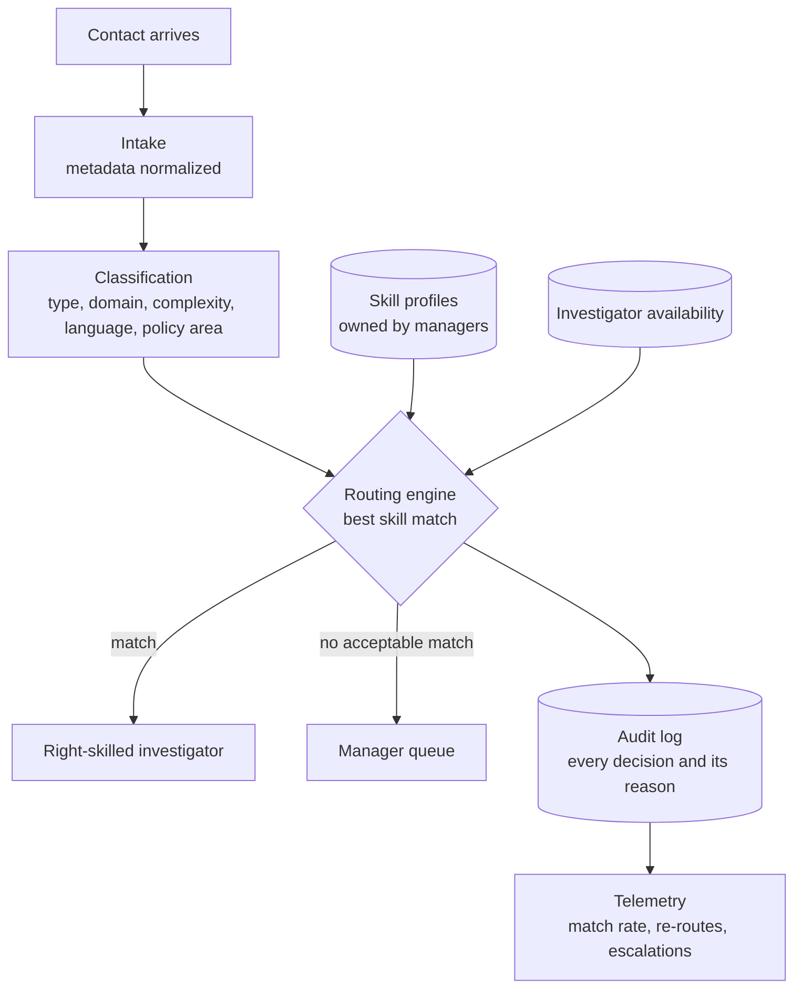

# Architecture: Intelligent Priority Routing

This is the architecture I created for the routing program, shown at diagram level. Component names are generic, and internal system names, thresholds and data are left out. Engineering wrote the code.

## The system in one picture

## What each part does

| Part | What it does |
|---|---|
| Intake | Receives every contact from the seller-facing entry points and normalizes its metadata. |
| Classification | Tags each contact by type, domain, complexity, language and policy area, so that the engine knows which skill the contact needs. |
| Routing engine | An ML engine that compares the classified contact with the skill profiles of the investigators who are available, and assigns the best match. |
| Skill profiles | One profile for every investigator, owned by the manager and editable without engineering support. |
| Availability | Tells the engine who is online and how much work each person already holds. |
| Manager queue | Takes any contact that has no acceptable match, so that it gets a decision instead of a random assignment. |
| Audit log | Records every routing decision together with its reason. |
| Telemetry | Shows match rate, re-route rate and escalation trend to operations managers and leadership. |

## How a contact moves through it

A contact arrives and is normalized at intake, and classification then describes what kind of work it is. The routing engine reads that description alongside two live inputs, the skill profiles and the availability of each investigator, and it assigns the contact to the best-matched person. When no acceptable match exists, the contact goes to a manager queue and never falls back to first-in, first-out. Every decision is written to the audit log with its reason, and telemetry is built from that log.

## Three design choices

1. **A contact with no match goes to a manager.** It never returns to the old first-in, first-out model while the engine is running.
2. **Every decision is logged with its reason.** That record is what makes quality reviews and routing disputes answerable.
3. **Shadow mode came before live traffic.** The engine first ran beside the existing model, with every decision logged and none actioned, and the go-live threshold was agreed before that phase began.

## The dependency to watch

The routing engine and a second production system read the same behavioral data source, so a schema change there would degrade both at once, with no alert. The control was governance, not technology: a named owner in the data team, a weekly review on the risk log, and any schema change routed through the steering committee before it shipped.

## Results

The engine routes 10M+ contacts a year. Executive escalations fell 90%, and the program delivered $5M in efficiency savings.

## My role

I framed the problem, created this architecture, aligned operations, product, engineering, science and policy, and launched it. Engineering wrote the code. I work at the architecture and requirements layer, and I do not write or review application code.
