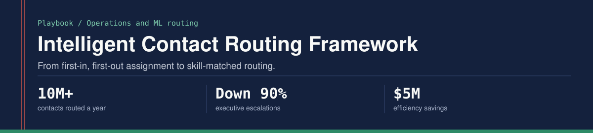
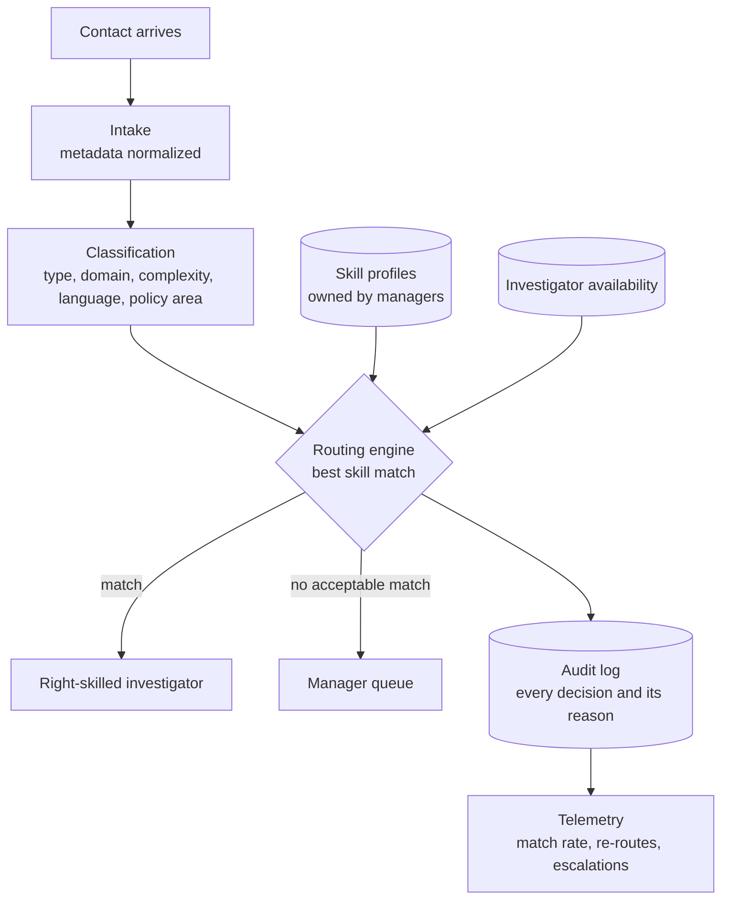

A program playbook for moving an investigations operation from first-in, first-out assignment to skill-matched routing.

Built from Intelligent Priority Routing, an ML engine I architected and launched at Amazon Seller Protection to distribute contacts to right-skilled investigators.

## Results

| Metric | Result |
|---|---|
| Volume routed | 10M+ contacts a year |
| Executive escalations | Down 90% |
| Efficiency savings | $5M |

## The problem in one sentence

Contacts were assigned on availability alone, so they landed with investigators who did not hold the right skill, which caused re-routes, slow resolutions and escalations that should never have existed.

## Root causes

| Area | Root cause |
|---|---|
| Process | Queue assignment was first-in, first-out, with no skill filtering. |
| People | No documented skill taxonomy existed for investigators. |
| Technology | The assignment system had no way to apply skill-based logic. |
| Data | No resolution-quality data was linked to the investigator and the contact type. |
| Policy | Some contact types needed specialized policy knowledge that not every investigator held. |
| Scale | Manual workarounds that held with a smaller workforce broke as the workforce grew. |

## Why it had not been solved

1. **Perceived complexity.** Routing was assumed to need a major engineering program.
2. **No single owner.** Operations, product and engineering each assumed another team owned it.
3. **A data gap.** Without a skill taxonomy, nobody could define a right-skill match.
4. **Growth masked it.** Adding investigators hid the mismatch.

## The reframe

This was not a staffing problem. It was a data and routing-logic problem: the investigators with the right skills existed and were not receiving the right contacts. Framed as a product problem rather than a capacity problem, the engineering ask became tractable.

## How the system works, at diagram level

1. **Intake.** A contact arrives and its metadata is normalized.
2. **Classification.** The contact is tagged by type, domain, complexity, language and policy area.
3. **Routing.** The engine compares the contact with the skill profiles of available investigators and assigns the best match. If there is no acceptable match, the contact goes to a manager queue, not back to first-in, first-out.
4. **Skill profiles.** Every investigator has a profile owned by their manager and editable without engineering support.
5. **Audit log.** Every routing decision is recorded with its reason.
6. **Telemetry.** Match rate, re-route rate and escalation trend are visible to operations managers and leadership.

The full walk-through is in [ARCHITECTURE.md](ARCHITECTURE.md).

## Launch sequence

1. **Foundation.** Agree the skill taxonomy with operations leadership and the contact taxonomy with policy; seed skill profiles for every active investigator.
2. **Shadow mode.** Run beside the existing assignment model; log every decision and action none. Agree the go-live threshold before this phase starts.
3. **Controlled launch.** Route a small share of volume; monitor daily against a rollback trigger agreed in advance.
4. **Full launch.** Move all volume; keep the old model only as a fallback for outages.

## A risk worth copying onto your own log

The routing engine and a second production system read the same behavioral data source. A schema change there would degrade both at once, with no alert. The control was governance, not technology: a named owner in the data team, a weekly review on the risk log, and any schema change routed through the steering committee before it shipped.

## What I did and did not do

I framed the problem, created the architecture, aligned operations, product, engineering, science and policy, and launched it. Engineering wrote the code. I work at the architecture and requirements layer, and the architecture here is at diagram level; I do not write or review application code.

## Author

Prateek Ratnakar. AI transformation and program leader; 12 years, nine of them at Amazon (May 2017 - Jun 2026), as Senior Program Manager in Amazon Seller Protection.

Amazon North Star Award (2025 and 2021) | Business Leader of the Year (2019) | IIT (BHU) Varanasi | IIM Bangalore

[Portfolio](https://prateek-ratnakar.github.io) | [LinkedIn](https://www.linkedin.com/in/prateekratnakar) | [GitHub](https://github.com/prateek-ratnakar)

Every figure here matches my resume, my portfolio and my interview answers. The content is generalized; no proprietary systems, data or code are included.
